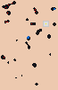

# Cellular-Automata-for-Multiple-Biome-Cave-Generation
Author: Reagan Sanz  
Desciption: This program simulates cave generation in a 2D video game using cellular automata. In addition, it generates different cave systems and parameters depending on the specifc "biome" the cave exists in.

## Instructions for Running ##
> make run

To clean
> make clean

## Example of Generated Caves ##
### Forest ###

### Desert ###

### Underwater ###

### Mountain ###

## TO DO ##
- ~~Make simple caves with ASCII images/art~~
- ~~Add more complex colors/features with pixel art~~
- ~~Implement different parameters for different biomes~~
- ~~(OPTIONAL) Add enemy spawns~~
- (OPTIONAL) Add Ore Spawning
- ~~(OPTIONAL) Add Water/Lava (possibly a second cellular automata?)~~
- ~~(OPTIONAL) Add unique generated rooms~~

## REFERENCES ##
- Used public domain code from nothing/stb [github] (https://github.com/nothings/stb/blob/master/stb_image_write.h) for creating PNGs of caves for visualization. 
